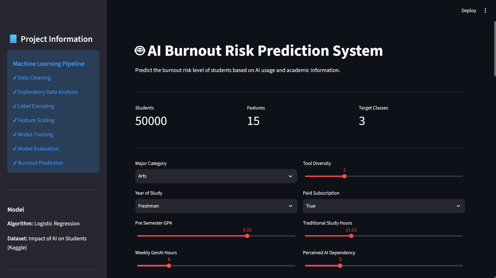
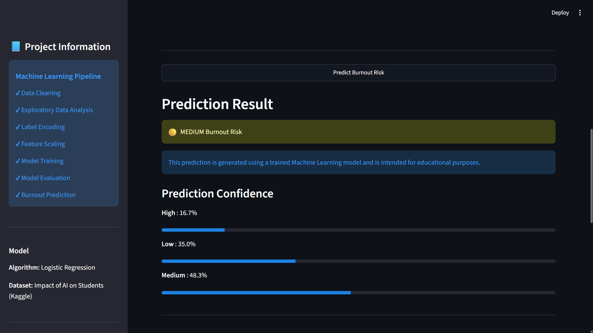
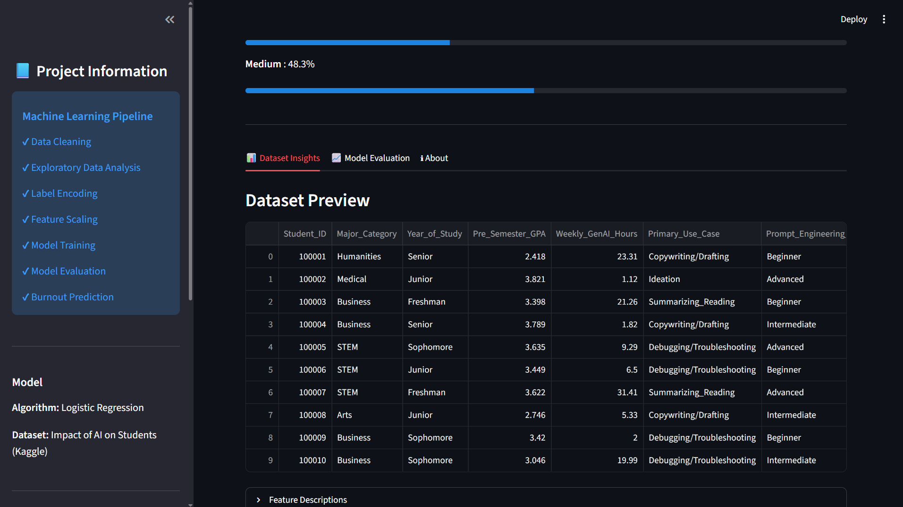
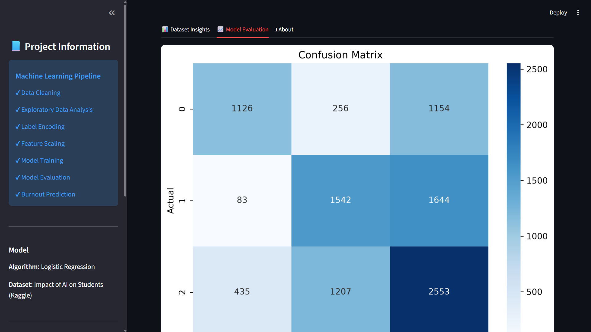

# 🤖 AI Burnout Risk Prediction System

A Machine Learning project that predicts **student burnout risk** based on AI usage habits, academic performance, and study behavior. The project includes data preprocessing, exploratory data analysis (EDA), model training and evaluation, and an interactive Streamlit web application for real-time predictions.

---

## 📖 Project Overview

The rapid adoption of Generative AI tools has transformed how students learn, research, and complete academic tasks. While AI improves productivity, excessive dependence may contribute to reduced skill retention and increased burnout.

This project analyzes student data and predicts burnout risk using machine learning algorithms trained on a Kaggle dataset.

The application allows users to enter student details through an intuitive web interface and instantly receive a predicted burnout risk level.

---

## ✨ Features

- 📊 Exploratory Data Analysis (EDA)
- 🧹 Data Cleaning & Preprocessing
- 🏷️ Categorical Feature Encoding
- 📏 Feature Scaling
- 🤖 Multiple Machine Learning Models
- 📈 Model Comparison
- 🎯 Burnout Risk Prediction
- 🌐 Interactive Streamlit Dashboard
- 📉 Prediction Confidence Visualization
- 📋 Dataset Preview
- 📷 Visualization Gallery

---

## 🛠 Technologies Used

| Category | Technologies |
|----------|--------------|
| Programming Language | Python |
| Data Analysis | Pandas, NumPy |
| Visualization | Matplotlib, Seaborn |
| Machine Learning | Scikit-learn |
| Model Serialization | Joblib |
| Web Application | Streamlit |

---

## 📂 Dataset

**Dataset:** Impact of AI on Students

The dataset contains information related to:

- Academic Performance
- Weekly AI Usage
- Prompt Engineering Skills
- Study Habits
- Tool Diversity
- AI Dependency
- Institutional Policies
- Anxiety During Exams
- Skill Retention
- Burnout Risk Level

Target Variable:

```text
Burnout_Risk_Level
```

Classes:

- Low
- Medium
- High

---

## 🧠 Machine Learning Workflow

```
Dataset
   │
   ▼
Data Cleaning
   │
   ▼
Missing Value Handling
   │
   ▼
Feature Encoding
   │
   ▼
Feature Scaling
   │
   ▼
Model Training
   │
   ▼
Model Evaluation
   │
   ▼
Prediction
   │
   ▼
Streamlit Web Application
```

---

## 📊 Machine Learning Models Used

The following algorithms were trained and compared:

- Logistic Regression
- K-Nearest Neighbors (KNN)
- Decision Tree Classifier
- Random Forest Classifier

### Model Accuracy

| Model | Accuracy |
|--------|---------:|
| Logistic Regression | **52.21%** |
| Random Forest | 51.17% |
| KNN | 44.07% |
| Decision Tree | 43.25% |

**Best Performing Model:** Logistic Regression

---

# 📁 Project Structure

```text
Impact-of-AI-on-Students/
│
├── app.py
├── requirements.txt
├── README.md
├── .gitignore
│
├── data/
│   ├── impact_ai.csv
│   └── cleaned_impact_ai.csv
│
├── images/
│   ├── correlation_heatmap.png
│   ├── burnout_distribution.png
│   ├── histograms.png
│   └── confusion_matrix.png
│
├── screenshots/
│   ├── home.png
│   ├── prediction.png
│   ├── dataset.png
│   └── evaluation.png
│
├── models/
│   ├── burnout_model.pkl
│   ├── scaler.pkl
│   └── label_encoders.pkl
│
└── src/
    ├── preprocess.py
    ├── eda.py
    ├── train_model.py
    ├── evaluate.py
    └── predict.py
```

---

# 📷 Application Screenshots

## 🏠 Home Page



---

## 🎯 Prediction Result



---

## 📊 Dataset Insights



---

## 📈 Model Evaluation



---

# 🚀 Installation

Clone the repository

```bash
git clone https://github.com/ziomega/Impact-of-AI-on-Students.git
```

Move into the project directory

```bash
cd Impact-of-AI-on-Students
```

Create a virtual environment

```bash
python -m venv .venv
```

Activate the environment

### Windows

```bash
.venv\Scripts\activate
```

### Linux / macOS

```bash
source .venv/bin/activate
```

Install dependencies

```bash
pip install -r requirements.txt
```

---

# ▶ Running the Application

Launch the Streamlit app

```bash
streamlit run app.py
```

or

```bash
python -m streamlit run app.py
```

---

# 📈 Exploratory Data Analysis

The project includes several visualizations:

- Correlation Heatmap
- Burnout Risk Distribution
- Feature Histograms
- Confusion Matrix

These visualizations help understand relationships between variables and evaluate model performance.

---

# 🔮 Future Improvements

- Deep Learning models using TensorFlow/PyTorch
- Hyperparameter tuning with GridSearchCV
- Explainable AI (SHAP/LIME)
- Feature importance visualization
- Batch CSV prediction
- Cloud deployment
- User authentication
- Real-time analytics dashboard

---

# 👨‍💻 Author

**Evaan Antony Philip**

Computer Science Engineering Student

Machine Learning Workshop Project

---

# 📄 License

This project is intended for educational and learning purposes.

---

## ⭐ If you found this project useful, consider giving it a star!